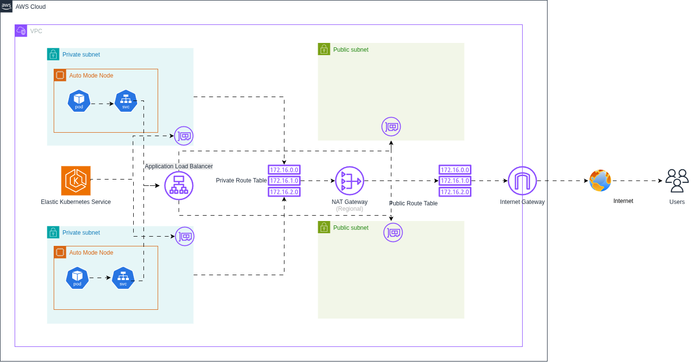

# eks-cluster

> Terraform infrastructure to provision an **AWS EKS cluster** in a modular and reusable way.

This repository contains Terraform code to create a VPC and an Amazon EKS cluster using custom modules, following Infrastructure as Code (IaC) best practices.

## 🧠 Overview

This project provisions:

✔️ A VPC with public and private subnets  
✔️ A managed AWS EKS (Elastic Kubernetes Service) cluster  
✔️ Fully parameterized configuration using Terraform variables  

The goal is to provide a clean and reusable baseline for Kubernetes infrastructure on AWS.

## 🗺️ Diagram Architecture



## 📌 Project structure

```
.
├── main.tf
├── variables.tf
├── modules
│   ├── eks
│   └── vpc
├── .gitignore
├── .terraform.lock.hcl
├── LICENSE
└── README.md
```

## 🚀 Prerequisites

Before getting started, make sure you have:

✔️ Terraform (recommended version: ~> 1.14.3)  
✔️ AWS CLI configured with valid credentials  
✔️ An AWS account with permissions to create IAM, VPC, EC2, and EKS resources

Check your Terraform version:
```
terraform version
```
## ⚙️ Usage

1. Clone the repository
```
git clone https://github.com/JvictorMarques/eks-cluster.git
cd eks-cluster
```

2. Configure variables  
Create a terraform.tfvars file:
```
aws_region                  = "us-east-1"
eks_cluster_name           = "my-eks-cluster"
eks_version                = "1.27"
principal_arns             = ["arn:aws:iam::123456789012:role/AdminRole"]

vpc_name                   = "infra-vpc"
vpc_cidr_block             = "10.0.0.0/16"
subnets_availability_zones = ["us-east-1a", "us-east-1b", "us-east-1c"]

default_tags = {
  Project = "eks-cluster"
  Owner   = "DevOps"
}
```

3. Initialize Terraform
```
terraform init
```

4. Plan and apply
```
terraform plan
terraform apply
```


<!-- BEGIN_TF_DOCS -->
## Requirements

| Name | Version |
|------|---------|
| <a name="requirement_terraform"></a> [terraform](#requirement_terraform) | ~> 1.14.3 |
| <a name="requirement_aws"></a> [aws](#requirement_aws) | 6.28.0 |

## Providers

No providers.

## Modules

| Name | Source | Version |
|------|--------|---------|
| <a name="module_eks_cluster"></a> [eks_cluster](#module_eks_cluster) | ./modules/eks | n/a |
| <a name="module_network"></a> [network](#module_network) | ./modules/vpc | n/a |

## Resources

No resources.

## Inputs

| Name | Description | Type | Default | Required |
|------|-------------|------|---------|:--------:|
| <a name="input_aws_region"></a> [aws_region](#input_aws_region) | AWS region | `string` | `"us-east-1"` | no |
| <a name="input_default_tags"></a> [default_tags](#input_default_tags) | Default tags to apply to all resources | `map(string)` | n/a | yes |
| <a name="input_eks_cluster_name"></a> [eks_cluster_name](#input_eks_cluster_name) | EKS cluster name | `string` | n/a | yes |
| <a name="input_eks_version"></a> [eks_version](#input_eks_version) | EKS cluster version | `string` | n/a | yes |
| <a name="input_principal_arns"></a> [principal_arns](#input_principal_arns) | Set of principal ARNs for EKS access entries | `set(string)` | n/a | yes |
| <a name="input_subnets_availability_zones"></a> [subnets_availability_zones](#input_subnets_availability_zones) | AZ for public and private subnets | `set(string)` | n/a | yes |
| <a name="input_vpc_cidr_block"></a> [vpc_cidr_block](#input_vpc_cidr_block) | VPC CIDR block | `string` | n/a | yes |
| <a name="input_vpc_name"></a> [vpc_name](#input_vpc_name) | VPC name | `string` | n/a | yes |

## Outputs

No outputs.
<!-- END_TF_DOCS -->
## 🤝 Contributing

Contributions are welcome!
Feel free to open issues or submit pull requests 🚀

## 📜 License

This project is licensed under the MIT License.
See the LICENSE file for more details.